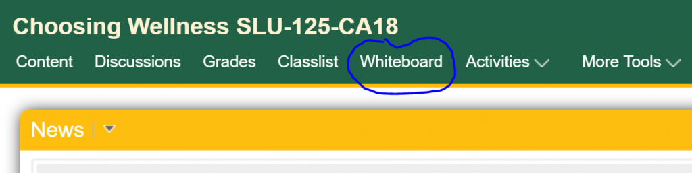
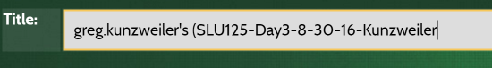

If your question is not answered below, try the [User Guide](guide.html).

## Content

- [How do I make MeTL full screen?](#how-do-i-make-metl-full-screen)
- [Which browser should I use?](#which-browser-should-i-use)
- [Which device should I use?](#which-device-should-i-use)
- [Why doesn't feature X work?](#why-doesnt-feature-x-work)
- [How do I set up a classroom computer with MeTL?](#how-do-i-set-up-a-classroom-computer-with-metl-) 
- [What is the URL for Whiteboard?](#what-is-the-url-for-whiteboard-) 
- [Conversation Search](#conversation-search)
  - [How do I find a conversation?](#how-do-i-find-a-conversation)
  - [How do I join a conversation?](#how-do-i-join-a-conversation)
  - [How do I rename a conversation?](#how-do-i-rename-a-conversation)
  - [How do I restrict a conversation to my class?](#how-do-i-restrict-a-conversation-to-my-class)
  - [How do I restrict a conversation so that only I can see it?](#how-do-i-restrict-a-conversation-so-that-only-i-can-see-it)
  - [How do I import a PowerPoint presentation?](#how-do-i-import-a-powerpoint-presentation)
- [Conversation](#conversation)
  - [How do I return to Conversation Search?](#how-do-i-return-to-conversation-search) 
  - [How do I select a single item?](#how-do-i-select-a-single-item) 
  - [How do I undo an action?](#how-do-i-undo-an-action) 
  - [How do I edit a text box?](#how-do-i-edit-a-text-box) 
  - [How do I zoom to a particular part of the Canvas?](#how-do-i-zoom-to-a-particular-part-of-the-canvas)
  - [How do I create a custom background on a page?](#how-do-i-create-a-custom-background-on-a-page)
  - [How do I send students a link to a particular page?](#how-do-i-send-students-a-link-to-a-particular-page)
  - [How do I delete inappropriate student content?](#how-do-i-delete-inappropriate-student-content)
  - [How do I export a conversation to Microsoft OneNote?](#how-do-i-export-a-conversation-to-microsoft-onenote-) 
  - [How do I print a conversation to PDF?](#how-do-i-print-a-conversation-to-pdf) 

## How do I make MeTL full screen?

In most browsers, press the F11 key (on some laptops you may have to hold the Function key while pressing F11).
 
*Note: Microsoft has not implemented this feature in the Edge browser.*

## Which browser should I use?

Development and testing are primarily performed on Chrome, Edge and Safari. Firefox and IE are generally less 
compatible with MeTL, so some features may not work as intended. Opera is untested.

## Which device should I use?

MeTL is designed with a responsive layout that works on both PCs and tablets. We test on large monitors, 
iPads and iPad minis.
 
## Why doesn't feature X work?
 
This table contains some known issues with the commonly used browsers that MeTL is tested with.
It is not an exhaustive list of features or browsers. 

Feature | Chrome (Win10) | Edge (Win10) | Safari (OSX) | Safari (iOS) | Firefox (Win10) | IE 11 (Win10) 
--- | :---: | :---: | :---: | :---: | :---: | :---:
Copy and paste image from file browser (O/S dependent) | y | y | y | n | y | y  
Copy and paste image from web browser (Google Images) | y | y | y | n | y | y
 
## How do I set up a classroom computer with MeTL?  
 
1. Find and join (or create) your conversation.
2. Click **Options**.
3. Click **Project this conversation**.
4. Sign in with your other device (tablet / laptop etc).

## What is the URL for Whiteboard? 

The URL is [https://whiteboard.lionsshare.saintleo.edu](https://whiteboard.lionsshare.saintleo.edu).

You can also access it through D2L under your courses. 

# Conversation Search

## How do I find a conversation?
Type the name of the conversation in the Search box and press Enter or click the Search button. 
You do not need to type in the entire name, a key word is sufficient. 
The search box is not case sensitive.

## How do I join a conversation?
Click on the search result row containing the conversation you want to join. 

## How do I rename a conversation?
1. Find the conversation from the list shown and click **Edit**.
2. Scroll down to the title box.
3. Update the title in the title box (it will save automatically).

4. Scroll back up to the top of the screen and click “Back to search” to return to the search screen, 
or “Join conversation” to join the conversation. 

The new name will appear in the Conversation banner.

## How do I restrict a conversation to my class?
By default when you create a conversation it is unrestricted. 

1. Click **Options**.
2. Click **Conversations**.
3. Find the conversation from the list shown and click **Edit**.
4. Scroll down to **Editable attribute**, find and select the group for your class.

The conversation is now restricted to that group.

## How do I restrict a conversation so that only I can see it?
By default when you create a conversation it is unrestricted. 

1. Click **Options**.
2. Click **Conversations**.
3. Find the conversation from the list shown and click **Edit**.
4. Scroll down to **Editable attribute**, find and select the group that matches your username.

If you restrict the conversation to yourself, only you can see and join it. 
This is useful if you want to prepare a conversation for a class but do not want students to see it until you are ready.

## How do I import a PowerPoint presentation? 
1. Click on **Create a conversation by importing a file**.
2. Browse to your PowerPoint presentation file and upload it.

Conversations can also be imported from PDFs and Word documents.

# Conversation

## How do I return to [Conversation Search](guide-conversation-search.html)?
1. Click **Options**.
2. Click **Conversations**.

## How do I select a single item?
When you click on the [canvas](guide.html#conversation-interface), all content that you own and that intersects the point you clicked will be selected. 
To deselect unwanted content, click on the unwanted content in an area where only that content occurs. 
You may have to do this several times to isolate a single piece of content from other content 
that has been selected because they overlapped the area that was selected. 

This is a subtractive method of content selection and is designed for mobile devices. 
It is the opposite of the additive method generally used in applications with a keyboard, such as PowerPoint.

## How do I undo an action?

An Undo button is not included because of the potential interactions between content belonging to different participants. 
If you want to undo a deletion, there is a feature that recovers deleted content. 

1. Click **Options**.
2. Click **Recycle Bin**.
3. Navigate to the deleted item and click **Restore Content**.

## How do I edit a text box?
1. Click **Text**.
2. Click the text you want to edit.

This will display a selection marquee around the text, and place you into edit mode.

[Learn More](articulate/working-with-text-boxes/story.html)

## How do I zoom to a particular part of the Canvas?
1. Click on **Zoom**.
2. Drag a marquee around the area you want to zoom into.

Note: the aspect ratio of the device screen will control the aspect ratio of the zoom marquee.

## How do I create a custom background on a page? 
1. Create a background (e.g. graph paper) in PowerPoint or a drawing application and save it as an image. 
2. Click on *Insert Image*.
3. Browse for your saved image.
4. Position and stretch it as desired. 

Using this principle, a library of desired images can easily be generated and reused.

## How do I send students a link to a particular page?
1. Click on **Options**.
2. Right click on **Deeplink this page** and *Copy link address*.
3. Paste the copied URL into your communication mechanism (e.g. email, Moodle).

Alternatively:
1. Click on **Options**.
2. Click on **Deeplink this page**.
3. The URL bar in the browser is modified to be suitable for linking.
4. Select and copy the URL from the browser bar.
5. Paste the copied URL into your communication mechanism (e.g. email, Moodle).

## How do I delete inappropriate student content?
To ban any text, ink or image on a Page (and place the author into private mode):
1. Click on **Select**.
2. Click on **Administer Content**.
3. Select the content you want to ban (by clicking on it or drawing a box around it).
4. Click on **Ban**.
5. The selected content has now been removed from public view and the author banned from further public contribution.

## How do I export a conversation to Microsoft OneNote? 

Log into the SLU Microsoft 360 account.  
Ensure that your OneNote Online account is synchronized with the 360 desktop account.

1. Click **Options**.
2. Click **Export this conversation**.

Export will open OneNote for the Microsoft account that you are currently logged into.
 
## How do I print a conversation to PDF?
You will need a *PDF Printer* driver installed on your device. 

1. Click **Options**.
2. Click **Print**.
3. Select the *PDF Printer* driver.