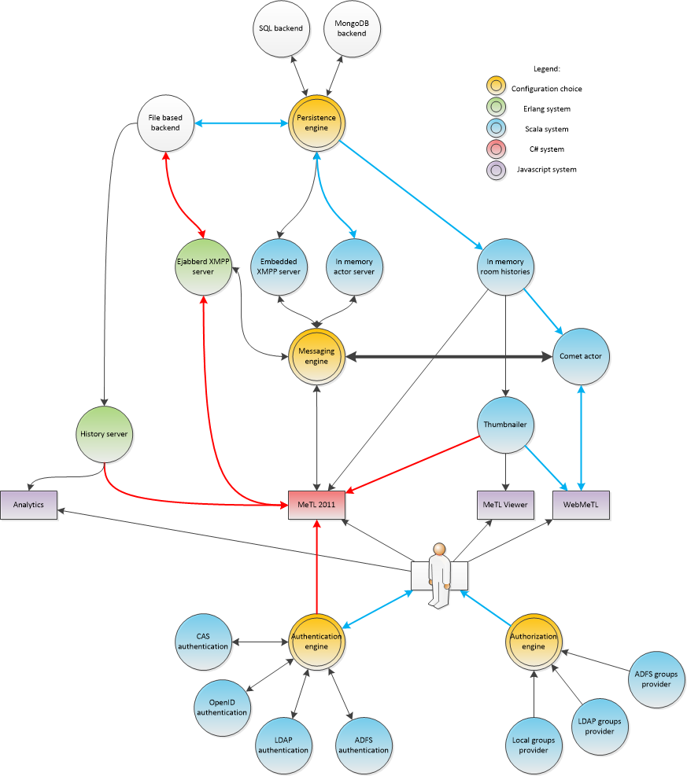

## Content

- [Concepts](#concepts) 
- [Configurability](#configurability) 
- [Components](#components) 
- [Authentication](#authentication) 
  - [CAS](#cas) 
  - [ADFS](#adfs) 
  - [Simple](#simple) 
  - [LDAP](#ldap) 
  - [OpenId](#openid) 
  - [OpenAuth](#openauth) 
- [Entities](#entities) 
  - [Structure](#structure) 
    - [Conversation](#conversation) 
    - [Slide](#slide) 
    - [Quiz](#quiz) 
  - [Canvas Content](#canvas-content) 
    - [Ink](#ink) 
    - [Text](#text) 
    - [Image](#image) 
  - [Submission](#submission) 
- [Integration](#integration) 

## Concepts

MeTL is at its heart a message hub with all messages being persisted for later retrieval.
This makes it a system for virtualising rooms.

Messages are sent to a specific space, and only people who are in that room will hear the message.

Messages can be user level, and be visible to a human user, or system level and used to coordinate clients behaviour.

All messages which have ever been through a room are retained, and can be replayed in order.
Server side mechanisms optimize the results so that, for instance, a sentence which was published, moved and
then later deleted does not show up in the client history at all.

Conversations are structured as a collection of slides and some metadata.
This is similar to the structure of a PowerPoint presentation, which enables some interoperability.

A slide is a room.

Each user has a private room on each slide.

Each conversation has a conversation global room.
Quizzes, submissions and attachments use this space, as they are not specific to a slide.

A server global room carries configuration data to all connected clients
(when a conversation is shared differently, for instance, this is broadcast globally in case that
conversation needs to be added or removed from a search result).

## Configurability

An installed MeTL system must configure one of each of:

- A persistence engine
- An authentication provider
- An authorization provider

## Components

MeTL is a web application, with a server implemented in Scala.

## Authentication

MeTL support several different strategies for authorization, which must be configured at server level. 
They are all web authentication strategies, some form submission and some redirect-based.

### CAS 

... <!-- TODO: complete -->

### ADFS 

To interact with an Active Directory Federation Service, a MeTL system must provide the following details in its configuration.

A keystore must be built on the MeTL server to store certificates for establishment of SSL.

    <saml>
       <serverScheme>https</serverScheme>
       <serverName></serverName>
       <serverPort>8443</serverPort>
       <maximumAuthenticationLifetime>
          28800 <!-- in seconds, must match corresponding settings in IDP -->
       </maximumAuthenticationLifetime>
       <expectedAttributes>
          <emailAddress>http://schemas.xmlsoap.org/ws/2005/05/identity/claims/emailaddress</emailAddress>
          <group>http://schemas.xmlsoap.org/claims/Group</group>
       </expectedAttributes>
       <callbackUrl>saml-callback</callbackUrl>
       <protectedRoutes>
         <route>authenticationState</route>
         <route>board</route>
         <route>future</route>
         <route>metlviewer</route>
         <route>summaries</route>
         <route>conversation</route>
         <route>slide</route>
         <route>slideNext</route>
         <route>slidePrev</route>
         <route>slideNavigation</route>
         <route>quiz</route>
         <route>quizzes</route>
       </protectedRoutes>
       <idpMetadataFileName>federationmetadata.xml</idpMetadataFileName>
       <keystorePath>exampleKeystorePath</keystorePath>
       <keystorePassword></keystorePassword>
       <keystorePrivateKeyPassword></keystorePrivateKeyPassword>
    </saml>
    
### Simple

... <!-- TODO: complete -->

### LDAP

... <!-- TODO: complete -->

### OpenId

... <!-- TODO: complete -->

### OpenAuth

... <!-- TODO: complete -->

# Entities

This section presents entities in non-compliant JSON Schema.

All entities share the following attributes:

    {
      server:{type:ServerConfiguration},       
      author:{type:String},
      timestamp:{type:Long}
    }
    
A `ServerConfiguration` indicates the top level location of the content. 
This can be used to differentiate between organizations, org units, or separate installations.

The author (user) is identified by a simple string UID.

The timestamp indicates the time at which the server processed the content. 
It is not dependent on the user’s locale or clock.

## Structure

### Conversation

A `Conversation` is the top level of content in MeTL. 
It is created by a user, and that user retains ownership rights over it. 
It may be thought of as a presentation of slides, and may be created by importing a Powerpoint presentation.

    {
      author:{type:String},
      lastAccessed:{type:Int},
      slides:{type:Array},
      subject:{type:String},
      tag:{type:String},
      jid:{type:Int},
      title:{type:String},
      created:{type:String},
      permissions:{type:Permission},
      configName:{type:String},
    }

### Slide

A `Slide` is a room level content space (now referred to in the user interface as Page). 
When a user enters a `Slide`, their client replays the history of content on that `Slide`.

    {
      id:{type:Int},
      author:{type:String},
      index:{type:Int},
    }

### Quiz

A `Quiz` (now referred to in the user interface as Poll) has an author, question and some answers to choose from.

    {
      type:"quiz",
      created:{type:Int},
      question:{type:String},
      id:{type:String},
      isDeleted:{type:Bool},
      options:{type:Array,items:{type:Option}}
    }
    
Quiz options are the available answers to choose from.

    {
      type:"quizOption",
      name:{type:String},
      text:{type:String},
      correct:{type:Bool},
      color:{type:Color}
    }

Quiz responses are an instance of an answer, tying a quiz response to a user.

    {
      type:"quizResponse",
      answer:{type:String},
      answerer:{type:String),
      id:{type:String})
    }
    
## Canvas Content

All objects which appear visually on the main canvas have the following attributes in common:

    {
      target:{type:String},
      privacy:{type:Privacy},
      slide:{type:String},
      identity:{type:String},
      scaleFactorX:{type:Double},
      scaleFactorY:{type:Double}
    }

The target is the location on which the content should appear (e.g. the private note space or the public canvas).

A `Privacy` can be Private or Public.

The identity of the element is a hash of its significant attributes, enabling simple comparison by value or 
identity when deduplication or modification is required.

### Ink

Ink is described in single strokes, which represent pressure variable paths.

    {
      type:"ink"
      bounds:{type:Array},
      checksum:{type:Double},
      startingSum:{type:Double},
      points:{type:,array","items:Point},
      color:{type:Color},
      thickness:{type:Double},
      isHighlighter:{type:Bool}
    }

A Point is a triplet of doubles pulled off the point string:

    {
      x:{type:Double},
      y:{type:Double},
      thickness:{type:Double}
    }

As a performance optimisation this is actually transmitted as “x y t x y t…”, but the conceptual model is that of a 
sequence of pressure aware Points.

### Text

... <!-- TODO: complete -->

### Image

... <!-- TODO: complete -->

## Submission

A submission is an image and a message.

    {
      title:{type:String},
      slide:{type:Int},
      url:{type:String},
      bytes:{type:Array,items:Byte},
      blacklist:{type:Array,items:String}
    }

The blacklist specifies users who are not permitted to view this submission.

# Integration

All work in all conversations by a user can be retrieved over HTTP:
- For a particular username: `/conversationSearch?query=[username]`
- For each of the conversation jids returned: `/detailsFor/[jid]`
- For each of the returned details.slides: `/fullHistory/[slideJid]`