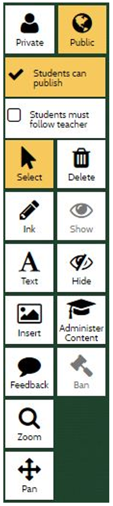
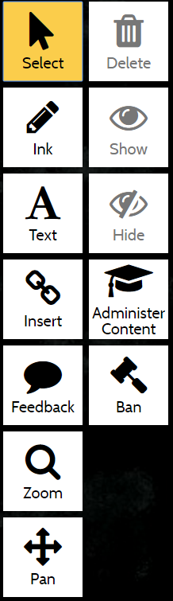
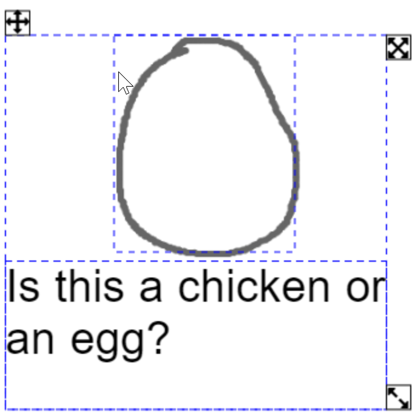
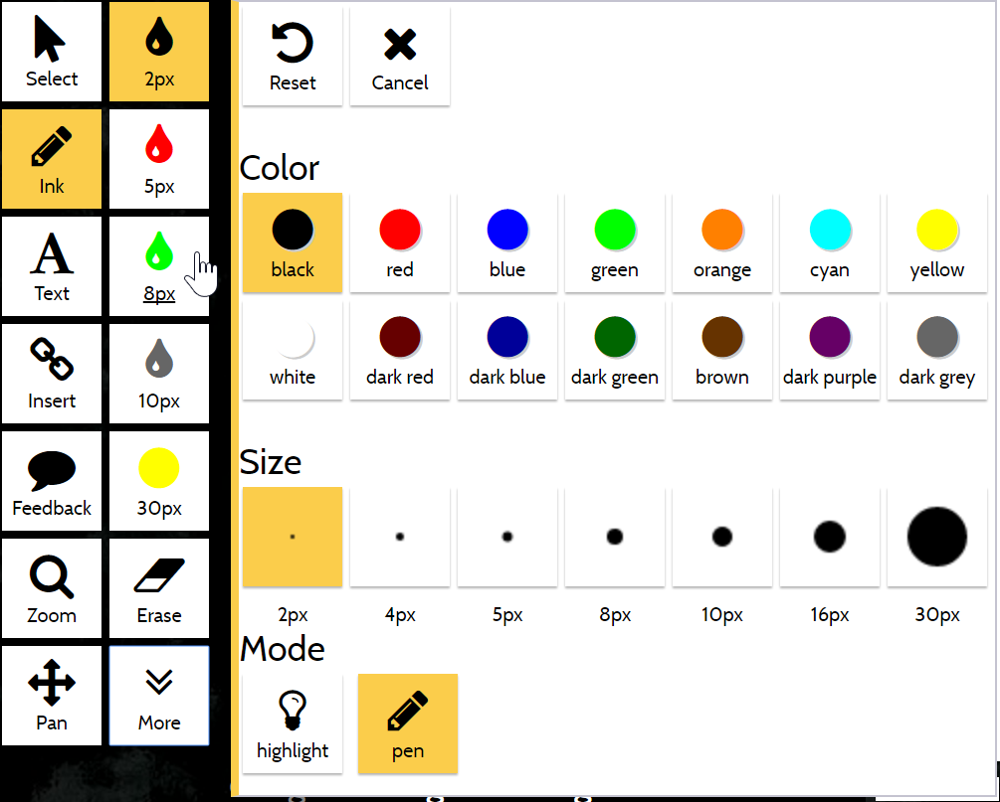
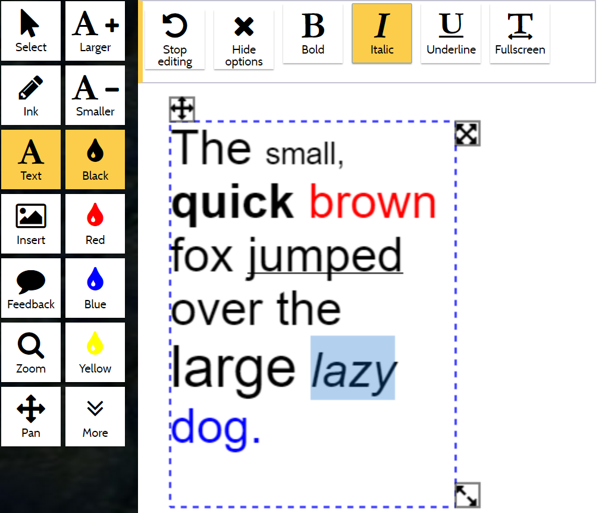
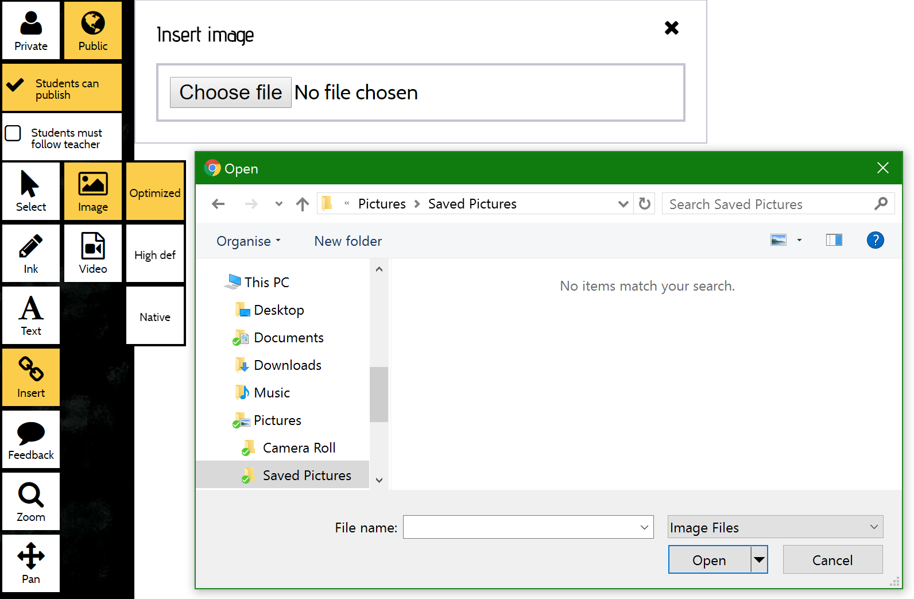
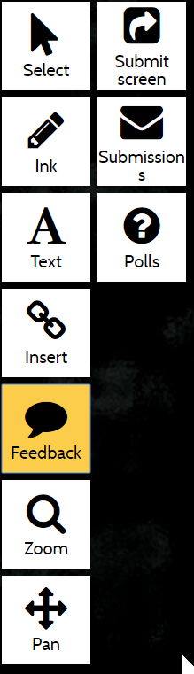
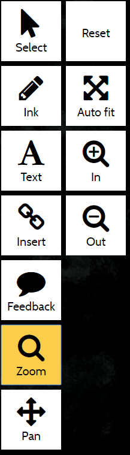
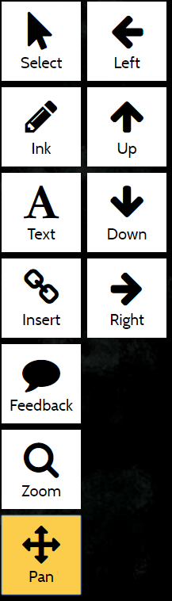

The state of a control is indicated by the background color.

- White means the control is available (e.g. the `Private` control). 
- Grey means the control is unavailable (e.g. the `Show` control). 
- Gold means the control is active (e.g. the `Public` control).

## Private / Public
 
This controls the visibility of new content (i.e. ink, text, image/video). 
 
- `Public` content will be visible to everyone. 
- `Private` content will only be visible to the creator. 

All users can insert private content at any time, but the conversation owner may restrict the ability of users to 
create public content or show (publish / make public) existing private content 
by using [`Students can publish`](#students-can-publish).

## Students can publish

Only available to the conversation owner. 

- Active: users can create new public content and [`Show`](#show) (publish) existing private content. 
- Inactive: users can only create private content, and existing private content may not be published.

## Students must follow teacher

Only available to the conversation owner.

- Active: when the owner navigates to a page other users will follow the owner to that page. 
- Inactive: when the owner navigates to a page other users will remain on their current page. 

Do <strong>NOT</strong> leave this active after class, or students will not be able to navigate to other pages for revision.
 

When the current user is not the conversation owner, a `Follow teacher` control appears below this control. 
This is used to choose to follow the conversation owner voluntarily.

## Select

When this control is active, select content by touching / clicking it or by dragging a marquee 
(all content that is intersected by the marquee will be selected).

Selected content is surrounded by a selection box which has three handles:

- Move (*top left*): click and drag the handle (or anywhere within the selection) to move all selected content. 
- Grow/shrink (*top right*): click and drag the handle to grow or shrink all selected content, retaining the original aspect ratio. 
- Deform (*bottom right*): click and drag the handle to change the height and/or width of all selected content.

When the selection contains more than one item, touch or click on unwanted content to remove it from the selection.
(MeTL uses a subtractive selection model to increase usability on touch devices.)   

### Delete
 
Remove the selected content from the canvas. 
Deleted content can be restored from the [Recycle Bin](guide-recycle-bin.html).

### Show

If the selected content is private, make it public.

### Hide

If the selected content is public, make it private.

### Administer Content

The conversation owner can select content created by other users. 
 
### Ban

Make the selected content private and ban the creator 
(prevent them from creating any new public content or publishing existing private content).

Use this control if students create inappropriate content.

Banned users can be unbanned in the [Banned Content](guide-learning#banned-content) screen.

## Ink

Ink is used for handwriting, underlining, highlighting or drawing.

Some commonly used color / size combinations are available on the main control panel, 
and ink can be highly customized by selecting the `More` control.

### Erase

Select an ink stroke to remove it. Erased ink can be restored from the [Recycle Bin](guide-recycle-bin.html).

### Mode

- Highlight: ink will appear behind text, like using a highlighter pen.
- Pen: ink will appear in front of text, like using a biro / sharpie.

## Text

Text boxes can be inserted by any device with a keyboard and can be resized, moved or formatted.

[More...](articulate/working-with-text-boxes/story.html)

## Insert

Adds an image or a video to the canvas. 
It may be selected from local storage, stored in an album or even captured from the camera 
(depending on the operating system and device).  

Subcontrols may be used to control the size / quality of the image.

## Feedback

### Submit screen 

Takes a snapshot of the canvas and send it to the conversation owner. 

### Submissions 

A list of submissions to the conversation.  The conversation owner can see all submissions.  Other users can only 
see their own submissions. 

### Polls 

The conversation owner can create polls and view responses.  Other users can see and respond to polls.

## Zoom
 

Use these controls to zoom in and out. The MeTL canvas is infinitely large, so zooming out allows more of the blank 
canvas on all sides to become visible.   

When `Zoom` is selected, dragging a marquee within the canvas sets the zoom level to display only that area. 

A two-finger pinch gesture can be used to zoom on devices that support it.

### Reset 

Reset the zoom to the original level. 

### Autofit 

Set the zoom level to show all content that is visible to the current user on the current page. 

## Pan

Move the viewport to make different areas of the canvas visible. 

A two-finger drag gesture can be used to pan on devices that support it.

