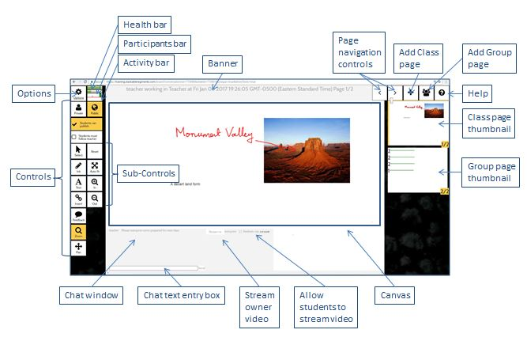
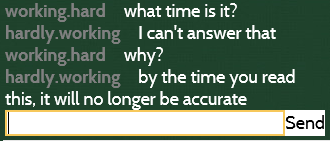

A conversation is a collection of pages where teachers and students share content. 

## Controls

Buttons for adding content and modifying conversation settings.
 
[More...]({{site.baseurl}}/guide-controls.html)

## Options

Conversation level options and additional features. 

[More...]({{site.baseurl}}/guide-options.html)

## Monitoring

This section measures three conversation / page metrics.  

### Health

This indicates how well the MeTL experience is running.

When the bar is green, it indicates a healthy internet connection and capable device.  When the bar is yellow, it indicates a poor internet connection and/or a device that is less capable of MeTL conversation.  The bar may occasionally become yellow for a moment before becoming green again - this is normal.

### Attendance

This indicates the population of the conversation.

If the page is associated with an external unit, the length of this bar shows `number of actual participants / number of enrolled participants`. If not, this will always be green.

### Activity

This indicates the most recent 30 seconds of activity on the current page.

Public content is displayed above the horizontal divider, and private content is displayed below.
 
## Banner

Displays the current user, name of the conversation and `current page number / total number of pages`.

## Canvas
 
Canvas content includes:
 
- [Ink](guide-controls.html#ink): freehand pen strokes (using finger, stylus or mouse as supported by the device)
- [Text](guide-controls.html#text): rich text including color, size and style (e.g. bold, underline, italic)  
- [Image](guide-controls.html#insert) / Video: from camera or via upload (as supported by the device and browser)

[More...]({{site.baseurl}}/guide-controls.html)

## Navigation

Use the navigation arrow buttons to go to the next or previous page.

## Add Page

Add a blank page immediately after the currently displayed page.

## Add Group Page

Add a page that observes content restriction by groups of users. 
Each member of a group can only see content from the other group members and the teacher. 
The teacher can see content from all users. 

[More...]({{site.baseurl}}/guide-groups.html)

## Thumbnails

Each page in the conversation is represented by a thumbnail preview. The thumbnail size is controlled with the slider above.

Select a thumbnail to move to that page.

## Chat

All users can send messages to the conversation, unless they have been [banned](guide-learning.html#banned-content).

 
## Face to Face over Video

The `Stream To` button allows users to stream video to other users in the conversation. 

<!-- [More...]({{site.baseurl}}/guide-video.html) -->