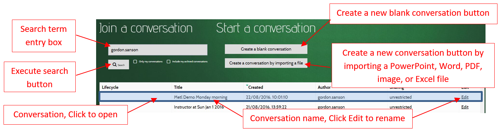

After logging into MeTL, users are directed to the Conversation Search page.

The search box will be populated with the current username as a default, 
and a list of the conversations created by the current user will be displayed below. 

## Join a Conversation
 
Search for and click on the conversation you want to join and you will be taken to the 
[Whiteboard]({{site.baseurl}}/guide-whiteboard.html) for that conversation.

## Start a Conversation

There are two ways to start a new conversation. 
Recently created conversations are tagged as **new** in the Lifecycle column.

### Create a Blank Conversation

This button creates an empty, unrestricted conversation with a single blank page. 
This is a good starting point for a free-form teaching session.   

### Create a Conversation by Importing a File

This button prompts for the user to choose a file to import, from which a new conversation will be created. 
This is useful when teaching materials have been created prior to the teaching session. 

Currently accepted file formats include: 

 Microsoft PowerPoint

 Microsoft Word

 Adobe PDF