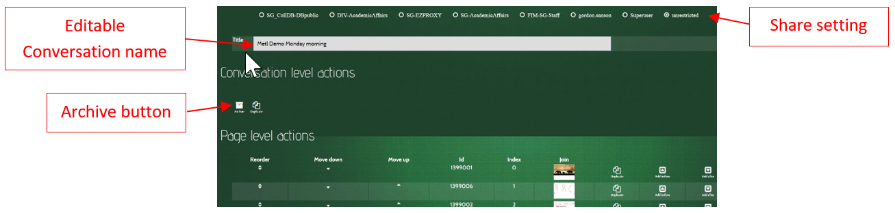

## Editable Attributes

### Sharing

A conversation is initially created with `Unrestricted` sharing, which means that all MeTL users can see and join it. 
The creator of a conversation may restrict access by using the dropdowns and radio buttons. 

If sharing is set to the creator then no one else can see or join it.

Restricting conversation sharing to the creator allows a conversation to be developed over time before making it visible to others.
 

If sharing is set to the class then all students in that class can see and join it. 

Restricting the sharing of a conversation by groups reduces clutter for other users when they are searching for conversations.
  

### Edit name
 
This is the name used when searching for a conversation. 
It may be directly modified within the edit box. 

Use unique and hierarchical names for conversations such as *EDU123 Week 1 Tuesday*. 
This will make it easier for the teacher and students to find a particular conversation.

## Conversation Level Actions

### Archive

Archiving a conversation removes it from search results for all users (including the creator). 
It can be found by selecting 
[`Include my archived conversations`]({{site.baseurl}}/guide-conversation-search.html#include-my-archived-conversations). 

Archiving a conversation will prevent students from seeing their own work. 
Conversations that students may have contributed to should not be archived until 
after all students have left the class that the conversation is shared with (eg end of semester).

### Duplicate Conversation

The `Duplicate` icon creates a copy of the conversation. 
Only content added by the creator will be copied to the new conversation (i.e. no student content will be copied).

## Page Level Actions

### Reorder Page

Click and drag in the `Reorder` column to move a page up or down. 
Click in the `Move Down` or `Move Up` columns to move a page up or down by a single step.
 
### Join

Click in the `Join` column to join the conversation at the selected page.

### Duplicate Page

The `Duplicate` icon creates a copy of the selected page, adding it as the next page. 
Only content added by the creator will be copied to the new conversation (i.e. no student content will be copied).
  
### Add Page

The `Add Before` icon adds a new blank page before the selected page.

The `Add After` icon adds a new blank page after the selected page.