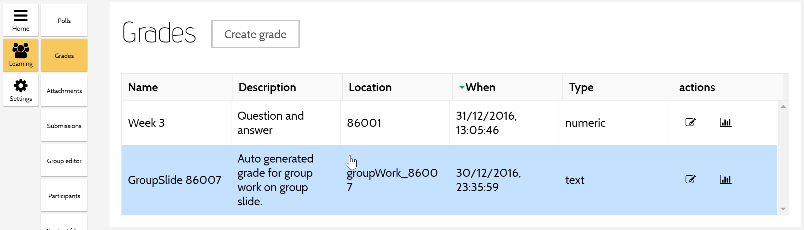
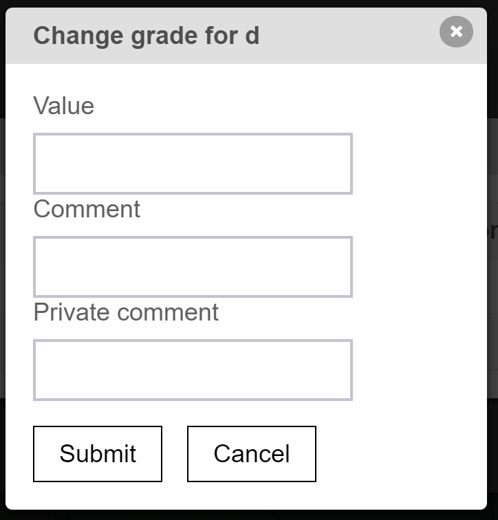

A teacher creates a grade to assign a score to each student in a conversation.   

The grade is stored in MeTL, but may also be associated with a grade in an external gradebook.
Once this association has been created, the teacher can send the score for each student to the external gradebook, 
and can display the student's grade as it is in the external gradebook 
(these may differ if they are updated in either system).

 D2L is used as the external gradebook for MeTL.
 
A group slide is a gradable event, so a grade is automatically created for each group page.

## View Grades
<!--

-->

<!-- Screenshot: three grades, two visible, one scored.  Student view of the table.-->

## Edit Grade

### Name

In order to associate the MeTL grade with a grade in an external gradebook, the name of the grade must be unique (within the external gradebook as well) and non-blank.

### Type

A grade has a type, that affects the way that the score is recorded:

- Numeric: must be a number between `Minimum` and `Maximum`.   
- Boolean: must be `True` or `False`.
- Text: a description of the score.

Changing the grade type will hide any scores that have been assigned against the original grade type.

### Visible to Students

The grade will only be visible to students if this is checked.

### Create Association

Create a grade in an external gradebook that corresponds to the MeTL grade.

Once the grade is associated with an external gradebook, the following options appear. 

### Remote Details

The identifier of the external grade that this MeTL grade is associated with. 

### Refresh From Remote

Update the `Remote Details` from the external gradebook. 

## Assess Grade

This screen shows the scores and comments recorded for each student.  If the grade is associated with an external gradebook, the `Remote` columns show the scores and comments stored in the external gradebook.
  
Select the row for a student to [change their score](#change-score). 

### Refresh Remote Data

Reread the `Remote Score`, `Remote Comment` and `Remote Private Comment` columns from the external gradebook.

### Send Grades

Send the `Score`, `Comment` and `Private Comment` column values to the external gradebook.

## Change Score

The teacher provides a score for each student within the grade.

### Score

The value stored for this student.  This may be boolean (true / false), numeric (between min and max values) or text.

### Comment

A comment that is visible to the student.

### Private Comment

A comment that is only be visible to the teacher.  

Once this has been sent to the external gradebook, 
all other teachers who have access to the grade will be able to see the private comment.
  