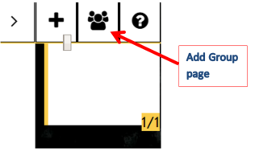
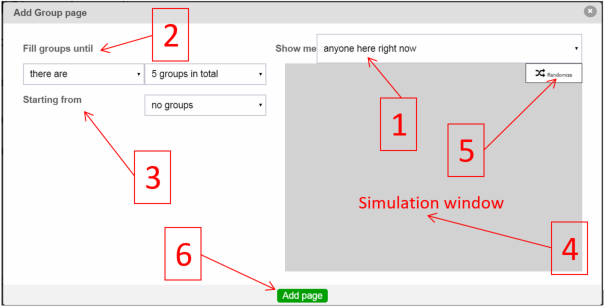

The members of a conversation (students) can be organized into groups by the conversation owner (teacher).  If MeTL is integrated with a third-party system that provides class information then the groups can be based on student enrollment into the class to which the conversation is restricted.

Use <code>show me all my enrolled students</code> for group projects that extend over days or weeks so that temporarily absent students may participate.  Use <code>Only show me my participating students</code> for group work that is to be done immediately by the students actually present.

A group page is created after the teacher's current page, and the students are assigned to groups according to rules selected by the teacher.  Each member of the class will be assigned to one and only one group.  The teacher will not be in any group but will be able to see all the content from all of them.

A member of a group (student) can only see content from the other group members (students) and the teacher.

The teacher can add content which is only visible to one group by using the `Isolate` control near the group listing in the Plugins bar.

A single conversation can organize the participants into different groups by creating different group pages.

  <a href="academy-pedagogy.html#learning-in-groups">Learning in Groups</a>,
  <a href="academy-pedagogy.html#self-selection">Self-Selection</a>,
  <a href="academy-pedagogy.html#teacher-selection">Teacher-Selection</a>,
  <a href="academy-pedagogy.html#random-selection">Random-Selection</a>,
  <a href="academy-pedagogy.html#smart-selection">Smart-Selection</a>

  <a href="academy-examples.html#prioritizing-the-unit-objectives">Prioritizing the Unit Objectives</a>

## Create Groups

The teacher creates a group page by pressing the button on the top right of the screen.

This will open the Add Group Page configuration dialog.

### 1. Select Student Cohort

There are three ways to select the student cohort when forming groups.

1. `Show me: anyone here right now` includes only students logged into the conversation at the time the Group Page is created. 

    
Use this for group work that is to be done immediately by the students actually present.

2. `Show me: anyone who has ever been here` includes all students who have ever joined the conversation (including those here right now). This allows the teacher to have visibility and control of the group to which a temporarily absent or disconnected student is assigned. It is useful when extending group work over a longer period of time.

    
Use this for group work that is to be done over days or weeks, where all students must be assigned to a group regardless of whether they are present at the time of group creation, and where the conversation is <strong>not restricted</strong> to a formal class enrolment.

    
If the conversation is not restricted to a formal class enrolment, MeTL will only know about students from the history of conversation attendees.

 
3. `Show me: anyone enrolled in <unit name>` includes students enrolled in the specified unit (whether currently present or not). This option is only available when the conversation is restricted to a formal class enrolment in an integrated LMS, as MeTL will use the list of currently enrolled students to form groups. 

    
Use this for group work that is to be done over days or weeks, where all students must be assigned to a group regardless of whether they are present at the time of group creation, and where the conversation is <strong>restricted</strong> to a formal class enrolment.

 Whiteboard is integrated with D2L courses and will use current D2L course information for student enrollments. 

### 2. Define Group Limits

There are two ways to define groups limits:

1. `Fill groups until: there are: <n> groups in total` keeps the number of groups constant, and fills each with as many students as necessary to assign the selected student cohort.
  
2. `Fill groups until: each has: only one member / at most <n> members` creates as many groups as necessary to keep each at the specified maximum while assigning the selected student cohort.

    
Selecting <code>only one member</code> creates one group per student, which is useful for individual student work that is visible only to the teacher, and can be annotated, commented on and graded (optionally with integration to the LMS gradebook).

 
Students who join the conversation after the group page has been created will be added one at a time to existing or new groups (depending on the defined group limits).

### 3. Fill Groups

There are three ways to initially populate groups.

1. `Starting from: no groups` forms groups randomly.

2. `Starting from: Smart Groups` imports groups using grouping rules based on information known to MeTL, currently including three homogenous and three heterogenous rules (Pedagogy [Learning in Groups](academy-pedagogy.html#learning-in-groups)): activity, classes and responses.

    1. `No Smart Groups` is the default, and does not form any groups.
    2. `Copy similar / different activity levels from Smart Groups` forms groups considering the level of activity in all conversations.
    3. `Copy similar / different classes from Smart Groups` forms groups considering all conversations that the student has ever joined.
    4. `Copy similar / different responsivity from Smart Groups` forms groups considering the responses to polls and submissions in all conversations.

3. `Starting from: <D2L Courses>` imports groups formed in an integrated LMS ( D2L at SaintLeo).
 
### 4. Simulation Window

Students are assigned to groups and displayed here to allow the teacher to view the result of their selected options before creating the Group Page.

Names displayed in red are assigned to groups created by Smart Groups or an integrated LMS ( D2L at SaintLeo).

### 5. Randomize

This control randomly assigns the selected student cohort to groups, using the defined group limits.  Only names displayed in black will be randomized, as MeTL will preserve any imported groups (in red).

### 6. Add Page

Create the Group Page using the groups displayed in the simulation window.

## Group Editor

The teacher may view and modify groups using the [Group Editor](guide-learning.html#group-editor).
