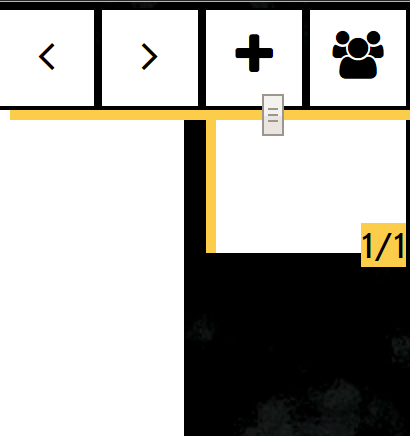
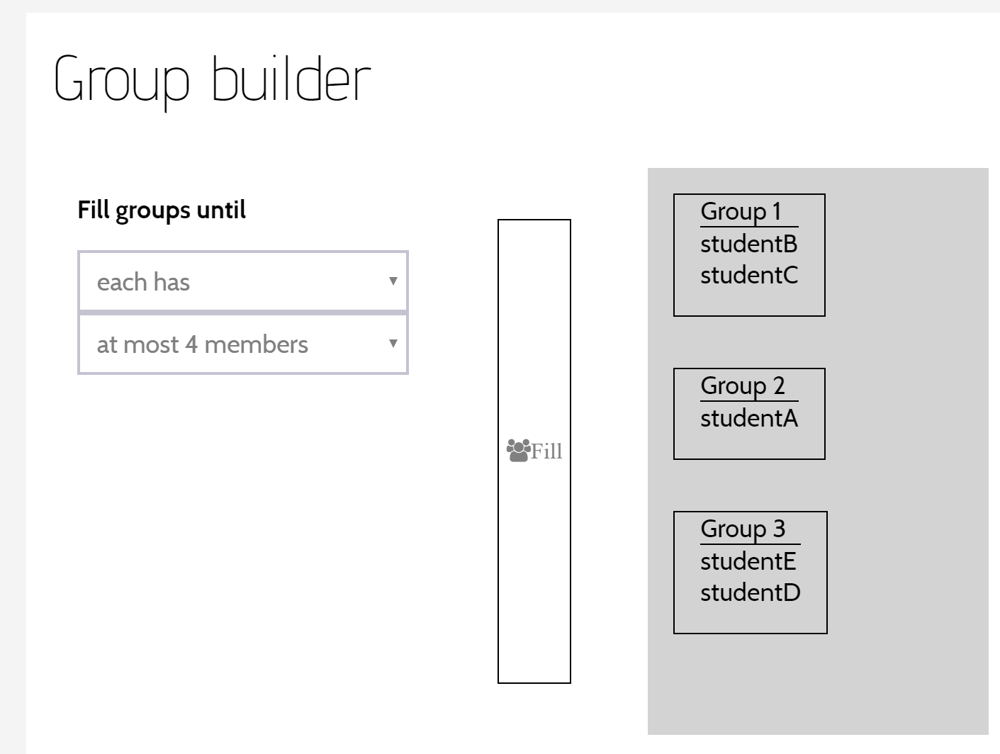

## Group creation

A conversation can be split into groups.  This can only be done by the author of the conversation (the teacher).

The groups will come into existence on a new page, which will appear in the conversation after the teacher's current page.  Each member of the class will be allocated into one and only one group.  The teacher will not be in any group but will be able to see all the content from all of them.

A member of a group can only see content from the other group members and the teacher.

The teacher starts creating a group by pressing the button on the top right of the screen.

This will open a configuration dialog.

The left side of this dialog captures enough information to enable the group page to be constructed.  The right side of the dialog shows the state of a group page after construction.  The page will not be constructed and no user will be grouped until the teacher presses the "Fill" button in the center.

A group page will ensure that any student who enters it is placed into a group.

To do this, it needs to be told what to prioritize.  The author may choose a specific number of groups among which to evenly divide the students, or a maximum group size. 

The author may also choose to include groups from centralized systems such as D2L.  If these groups are included, those groupings are guaranteed, even if they conflict with the earlier priorities.  MeTL will only use the prioritization information to group students who do not appear in a group.  

As these groups are toggled for inclusion, they appear on the right hand side of the dialog, in the groups space.

Only groups from the teacher's Org Units will be made available for inclusion.

Once the teacher has selected the priority for automatic filling and optionally included existing groups, they press "Fill".  A new page is then constructed, in which groups will always apply.  The teacher is taken to that new page.  The conversation is automatically set to "Students must follow" and the students are also automatically taken to the page.  As they arrive, they are allocated unless they already appeared in an external group.

The teacher may view the existing groups by reopening the dialog using the same button.  At this stage the prioritization strategy cannot be altered.  Groups may be rearranged by dragging and dropping the student names between them.

A student's content on this page will only be visible to the other members of the group.  The teacher can see content from all groups at once.  If the teacher wishes to filter out content to focus on a particular group's activity, they should use the Content Filter under Learning which has been created for the group.  If the teacher wishes to write in a space which is only visible to a group, they should use the Isolate functionality of the group listing in the Plugins bar.