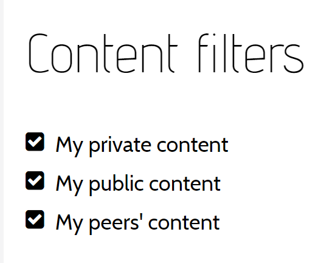

## Polls

The teacher can create polls, view responses and display the poll results in the conversation.

[More...](guide-polls.html)

## Grades

The teacher can assess students and assign grades.

[More...](guide-grades.html)

## Attachments

The conversation owner can attach files to the conversation that users can then download to their own devices.

This can be used to pass content to students such that they can add it to the <a href="guide.html#conversation-interface">Canvas</a> as themselves, 
which gives the user control over the content location (and whether it is private or public).

## Submissions

The submissions view shows the conversation owner content that users have submitted (including user name). 
The conversation owner can also choose to display the submission on the next page (without user name).

## Group Editor

The group editor shows the teacher the [Groups](guide-groups.html) on the current group page.  Students can also be dragged and dropped into different groups.

## Participants

The participants screen shows the conversation owner how active each user is on that page.  
This screen also contains the [Word Cloud](guide-word-cloud.html) analysis. 

## Content Filter

The content filter allows the conversation owner to hide their own private or public content or that of other users. 
This action only hides content on the user screen, it does not delete it. 

Using the content filter while projecting MeTL to the class can temporarily hide student content to focus on instructor content (or vice versa).

## Banned Content

Banned users can no longer create public content (or publish existing private content).
The conversation owner can select users to `Unban`, or `Unban All` banned users.

The banned content is also visible on this page. 