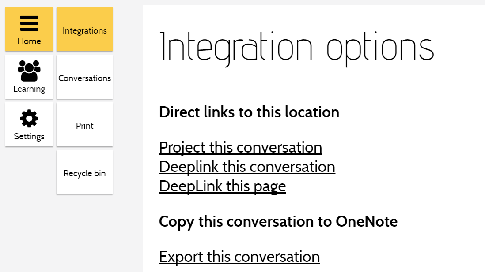
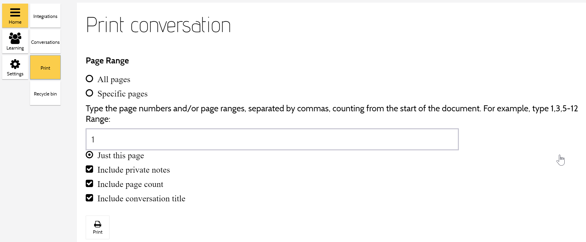
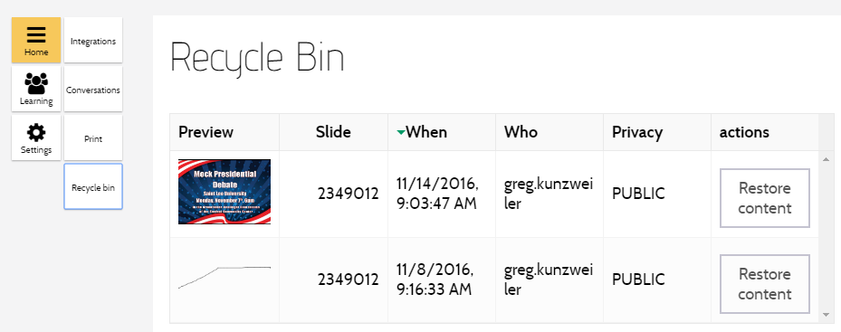

## Integrations

### Project this conversation

A view designed for use on a projector screen.
This hides most controls and uses the [content filter](guide-learning.html#content-filter) to only display public content. 

To leave this mode, exit and rejoin the conversation (select `Options` and `Conversations`, 
then [Join](guide-conversation-search.html#join-a-conversation) the current conversation). 

> Tip
>
> Log in as the teacher on both the class PC (that controls the projector) and on your portable device.
>
> 1. [Join](guide-conversation-search.html#join-a-conversation) the class conversation on the class PC. 
> 2. Select `Options` and `Project this conversation`. This will project only public content on the projector screen. 
> 3. [Join](guide-conversation-search.html#join-a-conversation) the same conversation on your portable device.
This allows you to see your own private content as well as any information that should not be displayed to the students
(such as student names on submissions).
> 4. The class PC will follow any navigation performed on your portable device. 

### Deeplink this conversation 

Update the browser URL bar with a deeplink which, when followed, will join the conversation.
 
> Tip
>
> Deeplink URLs can be copied and sent to students.

### Deeplink this page

Update the browser URL bar with a deeplink which, when followed, will join the conversation and navigate to the current page.

### Export this conversation 

Export the conversation to Microsoft OneNote.
 
>  Tip 
>
> First set up a OneNote account in Microsoft Office 365 (provided by Saint Leo University).

## Conversations

Return to [Conversation Search]({{site.baseurl}}/guide-conversation.html).

## Print

Send the entire conversation, or specific pages, to a printer. 

## Recycle Bin

Deleted text, ink and images are stored in the recycle bin, and can be restored to their original location.
The conversation owner can see content deleted by all users.
