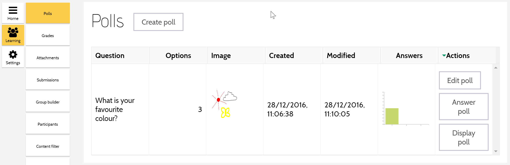
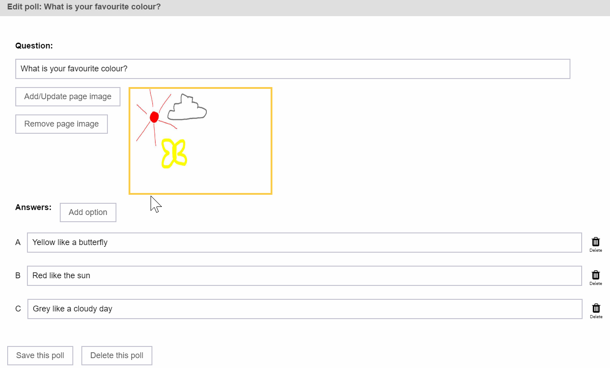
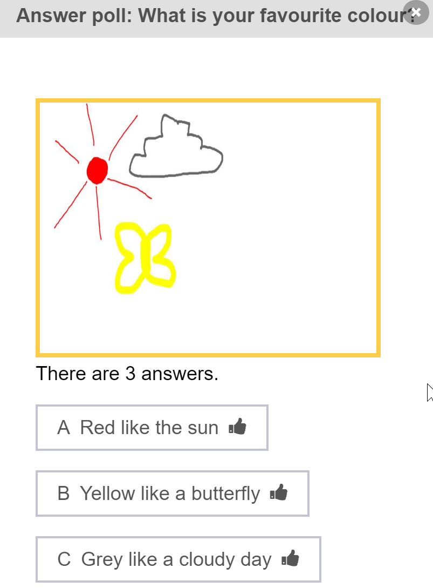
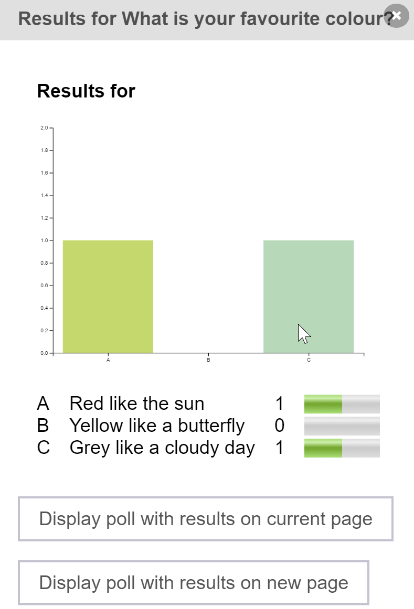

## View Polls

This is a list of the polls in the current conversation.

- `Options` contains the number of choices a student is given when answering.
- `Image` contains the (optional) image attached to the poll.
- The content of `Answers` varies:
  - When viewed by the teacher, this column contains a bar graph of all the answers chosen by students. 
  - When viewed by a student, this column contains only the answer chosen by that student.

### Create Poll / Edit Poll

The teacher uses this screen to create or modify a poll.

#### Page Image

The teacher may attach an image of the current page to the poll to provide context. 

`Add/Update page image` captures the current page and adds it to the poll.

`Remove page image` removes the image from the poll.

#### Options

A poll is initially created with three options.  

`Delete` removes the option from the poll, including all student answers that chose this option.
 
`Add option` adds an option to the poll.  There is no limit to the number of poll options.

#### Delete Poll

Remove this poll, including all student answers.

### Answer Poll

A user (teacher or student) chooses an answer to the poll on this screen.
  

### Display Poll

The teacher may display the poll results (a bar graph of all the answers chosen by students) 
as an image on the current page, or on a new page. 
 

This gives students a statistical view of how the entire class answered the poll.