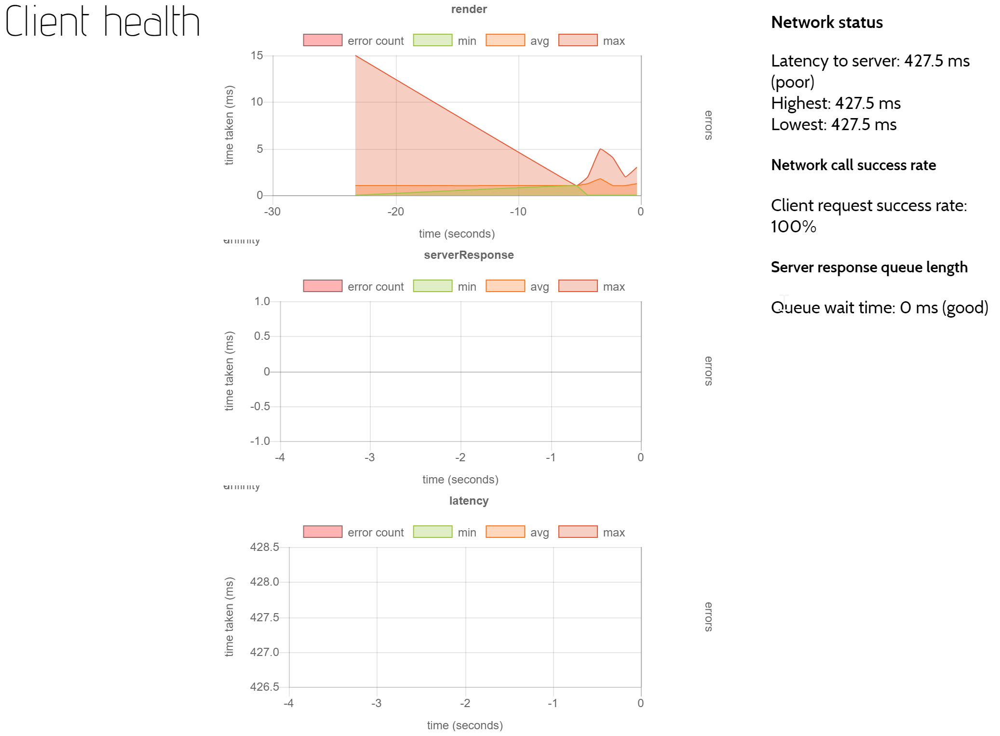

## Settings

### Show page list

Uncheck this box to hide the page [thumbnails](guide-controls.html#thumbnails) to the right of the canvas. 

### Show tools

Uncheck this box to hide the [controls](guide-controls.html) to the left of the canvas. 

## Health Check

The health check screen shows how well MeTL is running on your device, as well as server response time.

There are three main charts, but other charts may appear after certain actions have been taken in the conversation.

### Render
 
This shows how long a render takes, which is to do with the performance of your device and browser.  
The initial render may take longer than average, and then MeTL should be reasonably consistent.  

### Server Response

This shows how long the server takes to respond, which is related to network and server load.  

### Latency

This shows how long it takes for a message to reach the server, which is related to your network.

If you are having trouble with MeTL performance, the support team may ask for a screenshot of the Health Check screen.
 