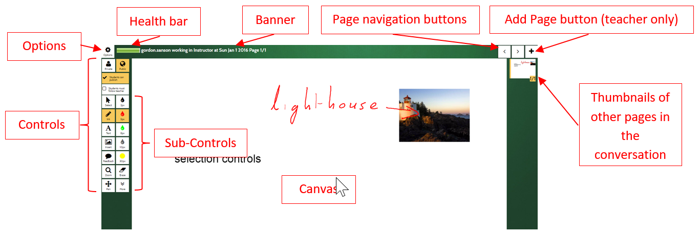

The Whiteboard is a collection of pages where teachers and students share content. 

## Canvas
 
Canvas content includes:
 
- Ink: freehand pen strokes (using finger, stylus or mouse as supported by the device)
- Text: rich text including colour, size and style (eg bold, underline, italic)  
- Image / Video: from camera or via upload (as supported by the device and browser) 

## Banner

Displays the name of the conversation and the current page number.

## Health Bar

A green bar that mostly fills the box indicates a healthy network connection and the device is capable of running MeTL. 
The bar may occasionally contract and become yellow for a moment before becoming green again, this is normal. 
However, if it stays in the yellow then your internet connection is poor and/or your device is too slow to manage a 
MeTL conversation.

## Navigation

Use the navigation arrow keys to go to the next or previous page, or touch on the thumbnail of the page you wish to 
join and display.

## Add Page

This button adds a blank page immediately after the current page being displayed.

## Thumbnails

Previews of all pages in the conversation are displayed. You can increase the size of the thumbnails by pressing 
Ctrl+ or Ctrl-.

