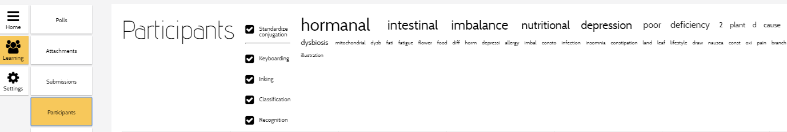

MeTL analyses text, ink and images to determine words that are contained in the content. 
The result of this analysis is displayed on the [Participants](guide-learning.html#participants) screen. 

The frequency of the words (how often they appear) is indicated by their size (larger means they occur more often).  

