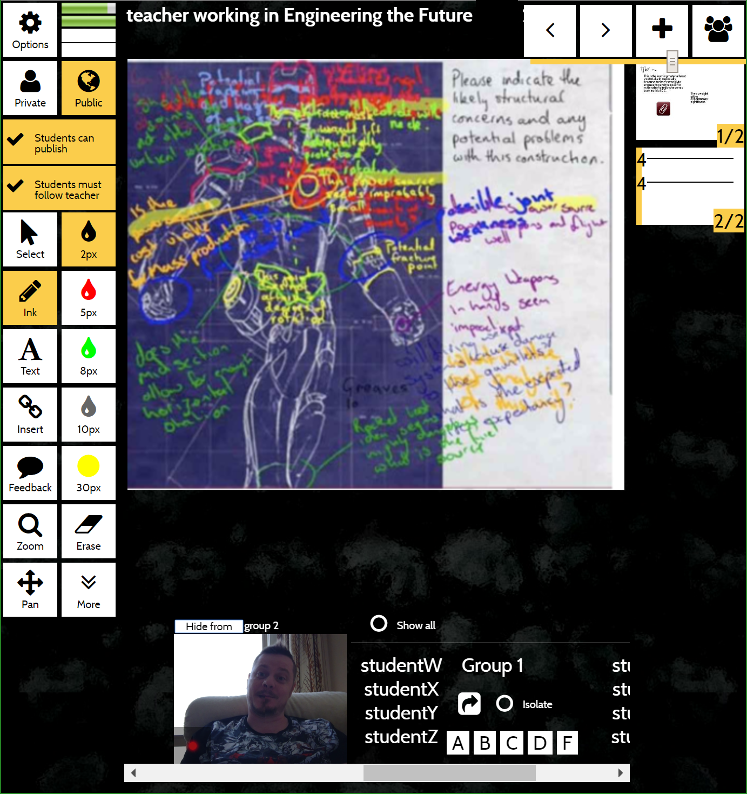

<h1>Welcome to MeTL</h1>

MeTL supports learning in a collaborative space for teachers and students. It is equally functional across synchronous and asynchronous spaces, and partners well with structured activity repositories such as LMSs and document stores. 

MeTL is fundamentally a shared visual space for anonymous freehand collaboration, as well as a fully featured multi-user video system supporting face-to-face collaboration and chat. It scales to hundreds of users in the same visual space, as well as more than 20 video streams per session interacting simultaneously.

All data in any medium shared across MeTL is automatically archived and is the foundation of a machine intelligence which actively intervenes during and after class. This guides teachers to devote their precious time and attention most effectively and gives unprecedented insight into the activity and understanding of a group.

<!--
## Executive

If you're in senior management and looking to take advantage of cloud and machine learning, or you're looking to 
maximize utilization of smartboard and tablet fleets you've already established, 
view our [executive](executive.html) proposition.
-->

## Academy

If you're looking to teach in a way which enables your class to spontaneously form effective working groups, maximizes remote participation and makes available structured advice on the outcomes afterwards, visit the [academy](academy.html).

<!--
## Architecture

If you're considering adopting this system and want to ensure that it fits with your IT policy, integrates to your centralized services and matches your expectations of data custody, explore our [architecture](architecture.html).
-->

## Support

If you're providing first or second level support for MeTL, refer to our [support guide](support.html).