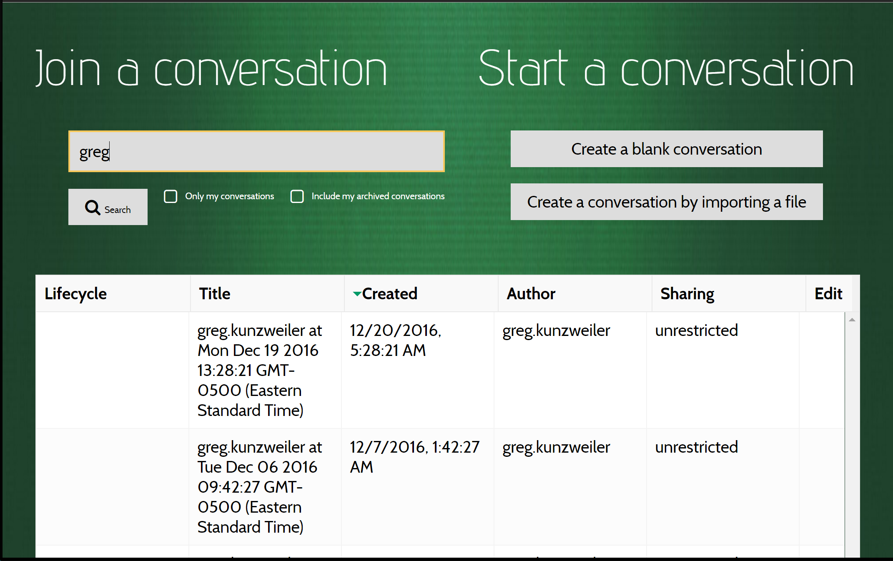
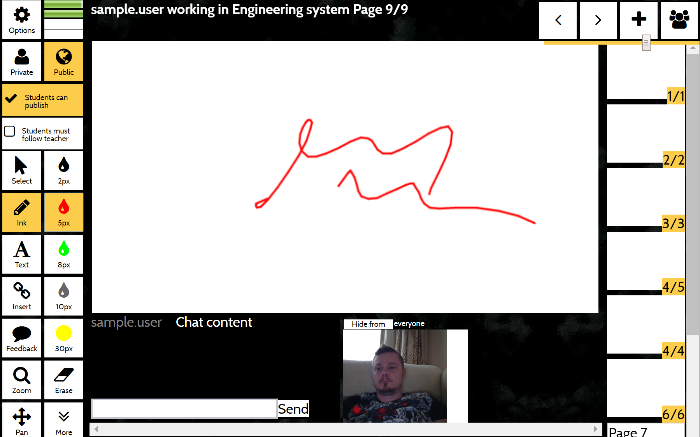
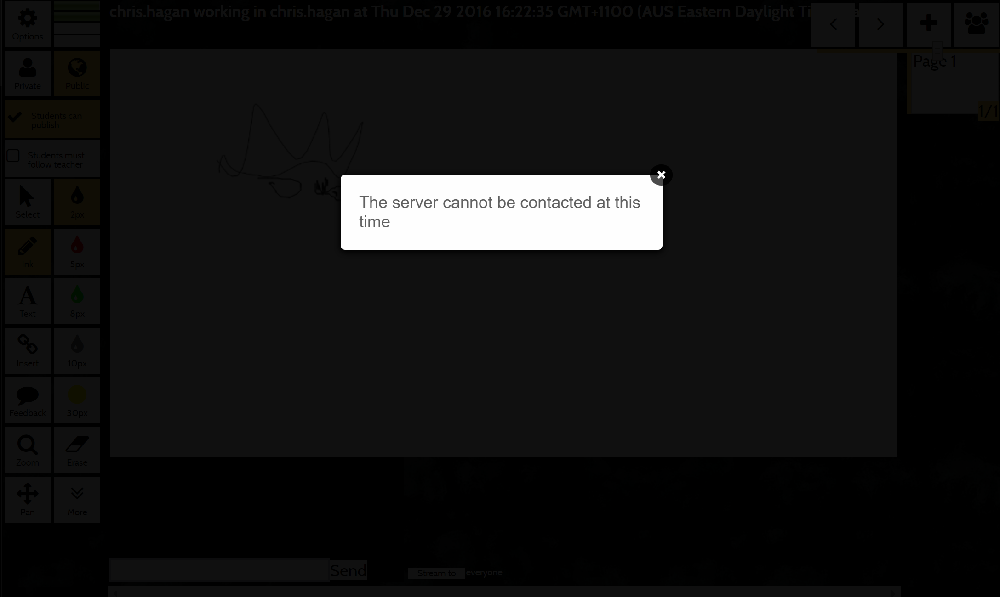

- [Are you connected to the network?](#are-you-connected-to-the-network)
- [Can you find the application?](#can-you-find-the-application)
- [Have you logged in to Saint Leo?](#have-you-logged-in-to-saint-leo)
- [Can you see the conversation search?](#can-you-see-the-conversation-search)
- [Can you find a conversation which is shared-with you?](#can-you-find-a-conversation-which-is-shared-with-you)
- [Do you see a healthy page?](#do-you-see-a-healthy-page)
- [Can you find content you created?](#can-you-find-content-you-created)
- [Are you disconnected from the network?](#are-you-disconnected-from-the-network)
- [Did MeTL do something you didn't expect?](#did-metl-do-something-you-didnt-expect)
- [Escalation](#escalation)

## Are you connected to the network?  

 Enter [saintleo.edu](http://saintleo.edu) into the address bar of your browser.  If you are connected to a network and have access to the internet, you will see the Saint Leo University home page.

Escalate to <a href="#uts-helpdesk">UTS Helpdesk</a>

## Can you find the application?

 The Whiteboard system can be found at [https://whiteboard.lionsshare.saintleo.edu](https://whiteboard.lionsshare.saintleo.edu), or through the Learning Management System.

It is also the `Whiteboard` link at [https://lionsshare.saintleo.edu](https://lionsshare.saintleo.edu).

Escalate to <a href="#uts-helpdesk">UTS Helpdesk</a>

## Have you logged in to Saint Leo?

 When you are at the login screen for single signon applications at Saint Leo, you should enter your username and password.  If you are still looking at the login screen, you have not authenticated successfully to the Saint Leo identity domain.

If you are not sure of your password, proceed to [https://uts.saintleo.edu/reset](https://uts.saintleo.edu/reset) for help.

If you have any issues, please contact UTS Helpdesk at (352) 588-8888 or 
<a href="mailto:helpdesk@saintleo.edu">helpdesk@saintleo.edu</a>.

Escalate to <a href="#uts-helpdesk">UTS Helpdesk</a>

## Can you see the conversation search?

 If you have successfully authenticated to the Saint Leo system, you should see the Conversation Search page.

If you do not see this page on login, try force refreshing your browser (see [refreshyourcache.com/en/cache](http://refreshyourcache.com/en/cache)).

Escalate to <a href="#metl-support">MeTL Support</a>

## Can you find a conversation which is shared with you?

If you have been instructed to find a conversation which isn't showing up in the search results, it may be that it is not shared to your class, or that you are not correctly enrolled.  Your professor may be able to help you check your enrollment, and will certainly be able to check the sharing of the conversation if they authored it.

Escalate to your professor, then <a href="#uts-helpdesk">UTS Helpdesk</a>

## Do you see a healthy page?

A healthy conversation has:
- The title of the conversation on the top of the screen.
- Your username before the title of the conversation.
- A central content space where your own ink is captured while in Ink mode.  Other people's content will also be displayed here.
- A set of tools on the left of the screen.
- A set of thumbnails on the right of the screen.

If any of these elements are not present, try force refreshing your browser (see [refreshyourcache.com/en/cache](http://refreshyourcache.com/en/cache)).

If these elements are all present, look at the health bar on the top left of your screen.

The top bar combines machine health and network health.  If it is yellow, you likely have a very poor network connection to MeTL or are not connected to the internet at all.  Did MeTL do something you didn't expect?

Check your settings and connection to the network.

Escalate to <a href="#uts-helpdesk">UTS Helpdesk</a>

## Can you find content you created?

Check that you are in the right conversation.  It is common practice to have many similarly named conversations as different sessions and groups teach the same material.

Check that you are still in the same group on the page where you authored the material.

Check the [Content Filter](guide-learning.html#content-filter) to see whether you are able to view your own material.

Escalate to <a href="#metl-support">MeTL Support</a>

## Are you disconnected from the network?

 

 If you are using a guest profile in the Saint Leo network, your session has a time limit.  Once this has expired, you will no longer be able to access the internet.  MeTL will display a disconnection message if this happens.

You will need to log onto the network again on a separate browser tab.  Once you have done this, refresh the MeTL tab and you will be returned to the conversation.

Escalate to <a href="#uts-helpdesk">UTS Helpdesk</a>

## Did MeTL do something you didn't expect?

You might like to consult the [MeTL FAQ]({{site.baseurl}}/academy-faq.html), a cross-institutional reference point for common usage and other questions.

 If you can't see how to fit Whiteboard into your instructional use case, consider consulting with the <a href="http://tali.saintleo.edu">Teaching and Learning Innovation</a> team.

Escalate to <a href="#tali">TALI</a>

# Escalation

## UTS Helpdesk
 Phone **(352) 588-8888** or email <a href="mailto:helpdesk@saintleo.edu">helpdesk@saintleo.edu</a>

## TALI
 <a href="http://tali.saintleo.edu">Teaching and Learning Innovation</a>

## MeTL Support
Email a screenshot and any error messages to <a href="mailto:support@stackableregiments.com">support@stackableregiments.com</a>